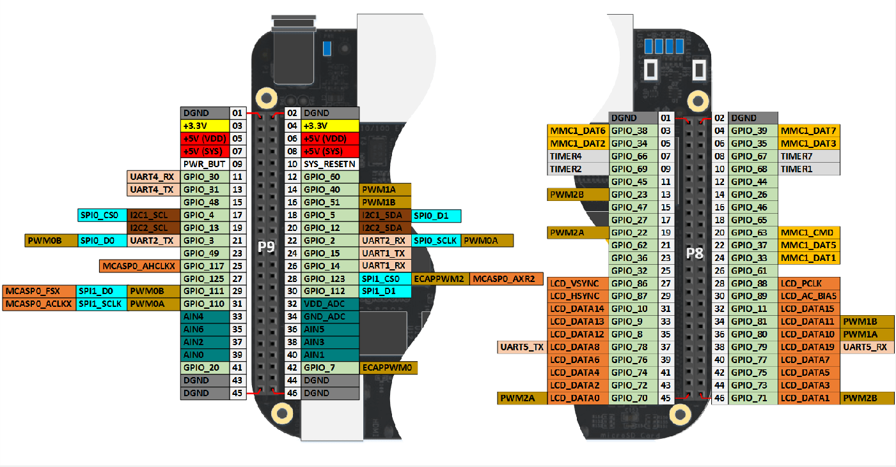
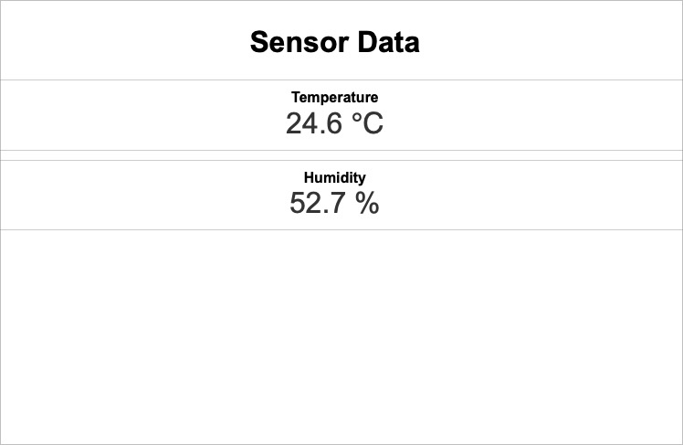

# Readme basic-aqm

# Air Quality Monitor
The Air Quality Monitor (AQM) project is a large development that requieres hardware, back-end programmming for the sensor, and front-end programming/configuration to display the measuring data. **To read about each step please visit the specific repositories.**

This repository is about the setup and configuration of the sensors, back-end (APIs), and front-end (dashboard). 

# Sensors setup
The project uses a PCB custom designed that includes the following sensors:

- HTU21D: Board Mount Humidity Sensors I.C 20D RH/T with I2C
- BH1750: Ambient Light Sensors Ambient Light Sensor Digital 16bit Serial I2C
- ZMOD4410: Air Quality Sensors TVOC IAQ Sensor with I2C output
- BMP581: Board Mount Pressure Sensors The BMP581 is a very small, low-power and low-noise 24-bit absolute barometric pressure sensor.

**Todo: add here the pcb image**

**However, you can connect the sensor-module version that is already prepared to communicate by I2C, like the one shown in the figure; htu21d module.**


## The HTU21D sensor
In case you want to test the application without the complete AQM-Hat, the sensor must be connected to the second I2C peripherical by:

P9.03 -> +3.3V (2nd pin - left position)
P9.01 -> DGND (1st pin - left position)
P9.19 -> I2C2_SCL (10th pin - left position)
P9.20 -> I2C2_SDA (10th pin - right position)




## Reading Data from HTU21D
The HTU21D sensor uses specific commands to read temperature and humidity data. Here’s how you can properly read and interpret this data. But first let us check if the device is connected and detected by the B3. 

Before starting, install the bash tools to work with I2C:

```sh
sudo apt update
sudo apt install i2c-tools
```

Also install the build essential libraries to compile in C:

```sh
sudo apt update
sudo apt install build-essential
```

Next, to check if the sensor is connected and detected by the B3 into the I2C port 2, try the next command:

```sh
sudo i2cdetect -y 2


Warning: Can't use SMBus Quick Write command, will skip some addresses
     0  1  2  3  4  5  6  7  8  9  a  b  c  d  e  f
00:
10:
20:
30: -- -- -- -- -- -- -- --
40:
50: -- -- -- -- -- -- -- -- -- -- -- -- -- -- -- --
60:
70:
```

This output **looks like there is no sensor connected at any address**. Nevertheless, for some reason the detection command is not checking the `0x40` line-address for the I2C. Thus we can try to directly read the specific addresses. To read the temperature, send the temperature measurement command (0xE3 for no hold mode or 0xF3 for hold mode) and then read two bytes of data.

```sh 
sudo i2cget -y 2 0x40 0xE3 w
0x3871
```

if you get a similar output in the terminal the sensor is properly connected and ready.

## Converting temperature measurements

**Pending Todo**

# Back-end Apps

## Compiling and testing the sensor C-Programs

In the repository folder, go to the `sensors` sub-folder and make each main.c file to read and store the measurements:

```sh
$ cd sensors/HTU21D
$ make
gcc -c -o main.o main.c -I.
gcc -o HTU21D main.o htu21d.o -I. -li2c
$ ./HTU21D
{ "temperature": 24.60, "humidity": 52.50 }
```

The previous output indicates that the `HTU21D` executable is now working. **Do the same for all sensors.**
```sh
cd sensors/BMP180
make
cd ..
cd sensors/XXXX
make
cd ..
```
Finally, let us prepare the `JSON` files to test the Dashboard:
```sh
./sensors/HTU21D/HTU21D > ./data/HTU21D.json
...
```

# Front-end Dashboard
This project provides a basic web dashboard to test the functionality of the AQM-hat. The way it works and a improved version are presented later, after understanding how to prepare data and the web server to visualize the dashboard. 

## Configuring Nginx

First install the Nginx package in the B3 board:
```sh
sudo apt update
sudo apt install nginx
```

Next, let's redirect the configuration file to our repository folder:
```sh
sudo vi /etc/nginx/sites-available/default
```

Replace the line:
```
root /var/www/html;
```

with:
```
root /home/debian/path/to/your/repository;
```

in my particular case:

```sh
root /home/debian/lwc/7-air-quality-ui/basic-ui;
```

```sh
sudo systemctl restart nginx
```


Open the web interface and type the IP addess of your device or visit the hostname + .local (`http://bbgmarx.local`); you should see a UI similar to the next one:




# Simple Sensor Dashboard
A simple sensor dashboard has been developed to fetch the data from the `JSON` files and then show them in a HTML fashion. The dashboard UI es updated every 60 seconds and considers a minimal HTML with CSS and JavaScript.

```html
<!DOCTYPE html>
<html lang="en">
<head>
  <meta charset="UTF-8">
  <meta name="viewport" content="width=device-width, initial-scale=1.0">
  <title>Simple Sensor Dashboard</title>
  <style>
    body { font-family: Arial, sans-serif; text-align: center; }
    .sensor { margin: 10px; padding: 10px; border: 1px solid #ccc; }
    .sensor-title { font-weight: bold; }
    .sensor-value { font-size: 2em; color: #333; }
  </style>
</head>
<body>

  <h1>Sensor Data</h1>
  <div id="temperature" class="sensor">
    <div class="sensor-title">Temperature</div>
    <div class="sensor-value" id="temp-value">--</div>
  </div>
  <div id="humidity" class="sensor">
    <div class="sensor-title">Humidity</div>
    <div class="sensor-value" id="humidity-value">--</div>
  </div>

  <script>
    async function fetchData() {
      try {
        const tempResponse = await fetch('./data/HTU21D.json');
        const tempData = await tempResponse.json();
        document.getElementById('temp-value').textContent = tempData.temperature.toFixed(1) + ' ℃';
        document.getElementById('humidity-value').textContent = tempData.humidity.toFixed(1) + ' %';
      } catch (error) {
        console.error('Error fetching data:', error);
      }
    }

    // Update data every 60 seconds
    setInterval(fetchData, 60000);
    fetchData(); // Initial fetch
  </script>
</body>
</html>
```
## Code Explanation

### HTML Structure

1. **Header**:
   - Sets the character encoding and viewport for responsiveness.
   - Styles the page with a basic CSS structure for sensor data presentation.

2. **Sensor Display Elements**:
   - The dashboard includes two sensors: **Temperature** and **Humidity**.
   - Each sensor reading is displayed in a `.sensor` box with a title and value.

### CSS Styling

- **General Styles**: Applies a basic font style (Arial) and centers the text.
- **Sensor Box Styling**: `.sensor` boxes have a border, padding, and margin to create separation between sensor readings.

### JavaScript Logic

1. **Data Fetching (`fetchData`)**:
   - Uses `fetch()` to retrieve JSON data for temperature and humidity.
   - Updates the corresponding HTML elements with the latest data.

2. **Automatic Refresh**:
   - `setInterval(fetchData, 60000);` updates the sensor data every 60 seconds, ensuring it stays current.


Ensure that the JSON file is regularly updated by a background service or script to keep the data current.


# Data updating

Configure root’s crontab to update data every 5 minutes

```sh
sudo crontab -e
```

Edit it like so:

```sh 
*/5 * * * * /usr/bin/python -m mh_z19                > /home/pi/anavi-phat-sensors-ui/data/MH_Z19.json
*/5 * * * * /home/pi/anavi-phat-sensors-ui/sensors/HTU21D/HTU21D > /home/pi/anavi-phat-sensors-ui/data/HTU21D.json
*/5 * * * * /home/pi/anavi-phat-sensors-ui/sensors/BMP180/BMP180 > /home/pi/anavi-phat-sensors-ui/data/BMP180.json
*/5 * * * * /home/pi/anavi-phat-sensors-ui/sensors/BH1750/BH1750 > /home/pi/anavi-phat-sensors-ui/data/BH1750.json
```