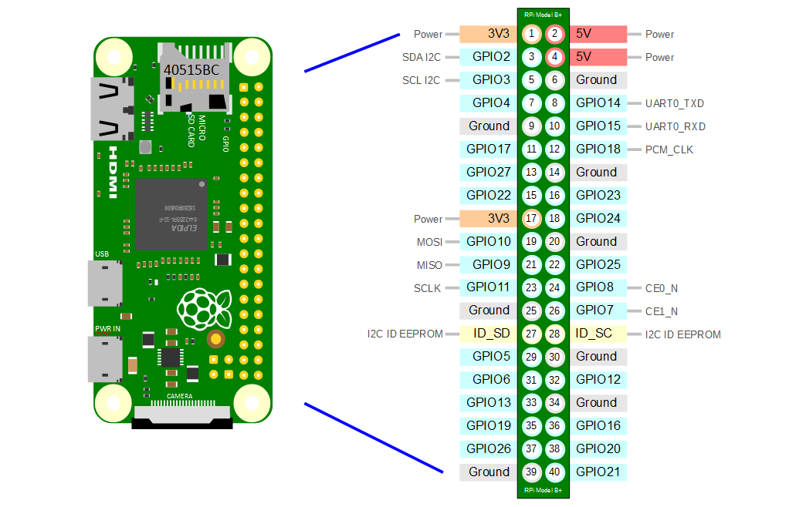

# Introduction
This repository guides you to implement and use the HTU21D temperature and humidity sensor by using I2C communication. The repository contains the following files:

- `htu21d.h` library header files
- `htu21d.c` implemenation methods file
- `main.c` an example file to test I2C communication using the library `htu21d`
- `example` output file precompiled in a raspberry pi zero that returns temperature and humidity

# Setup the raspberry

## Enable I2C on the Raspberry Pi:
- Run sudo raspi-config.
- Navigate to Interfacing Options → I2C and enable it.
- Reboot the Pi.
 
## Install I2C Tools and Development Libraries: 

```
sudo apt-get update
sudo apt-get install i2c-tools libi2c-dev
```
## Check if the sensor is detected:

```
sudo i2cdetect -y 1
```
This command should show an address for the HTU21D, typically 0x40.
```
     0  1  2  3  4  5  6  7  8  9  a  b  c  d  e  f
00:                         -- -- -- -- -- -- -- --
10: -- -- -- -- -- -- -- -- -- -- -- -- -- -- -- --
20: -- -- -- -- -- -- -- -- -- -- -- -- -- -- -- --
30: -- -- -- -- -- -- -- -- -- -- -- -- -- -- -- --
40: 40 -- -- -- -- -- -- -- -- -- -- -- -- -- -- --
50: -- -- -- -- -- -- -- -- -- -- -- -- -- -- -- --
60: -- -- -- -- -- -- -- -- -- -- -- -- -- -- -- --
70: -- -- -- -- -- -- -- --
```

# My own header files for HTU21D sensor
This is a detailed guide to configure and create your own files to comunicate with each sensor used by the air-quality sensor.

## Header 
Create the Header File `htu21d.h` with Header Guard and Includes:

```c
#ifndef HTU21D_H
#define HTU21D_H

// I2C Address
#define HTU21D_I2C_ADDR 0x40
// Commands
#define HTU21D_TEMP 0xE3
#define HTU21D_HUMID 0xE5
#define HTU21D_RESET 0xFE


// Function declarations:

// Temp
int getTemperature(int fd, double *temperature);
// Humidity
int getHumidity(int fd, double *humidity);

#endif // HTU21D_H
```

##  Implement the Sensor Communication `htu21d.c`

```c
#include <unistd.h> //to send commands to and receive from I2C device
#include <sys/ioctl.h>//setting up and controlling the I2C device settings
#include <linux/i2c-dev.h>//definitions for system calls and structures specific to I2C
#include <i2c/smbus.h>//SMBus commands in a more standardized way for I2C
#include <stdio.h>//perror

#include "htu21d.h" // my own header file

// Reset function:
int reset(int fd)
{
        if(0 > ioctl(fd, I2C_SLAVE, HTU21D_I2C_ADDR))
        {
                perror("Failed to open the bus");
                return -1;
        }
        i2c_smbus_write_byte(fd, HTU21D_RESET);
        return 0;
}

// Get temperature:
int getTemperature(int fd, double *temperature)
{
        reset(fd);
        char buf[3];
        __s32 res = i2c_smbus_read_i2c_block_data(fd, HTU21D_TEMP,3,buf);
        if(res<0)
        {
                perror("Failed to read from the device");
                return -1;
        }
        *temperature = -46.85 + 175.72 * (buf[0]*256 + buf[1]) / 65536.0;
        return 0;
}


// Get humidity:
int getHumidity(int fd, double *humidity)
{
        reset(fd);
        char buf[3];
        __s32 res = i2c_smbus_read_i2c_block_data(fd, HTU21D_HUMID, 3, buf);
        if(res<0)
        {
                perror("Failed to read from the device");
                return -1;
        }
        *humidity = -6 + 125 * (buf[0]*256 + buf[1]) / 65536.0;
        return 0;
}
```


### Using the library

```c
#include <stdio.h>
#include <errno.h>
#include <stdlib.h>
#include <string.h>
#include <fcntl.h>

#include "htu21d.h"

int main()
{
        char filename[20];
        snprintf(filename, 19, "/dev/i2c-%d", 1);
        int fd = open(filename, O_RDWR);
        if (0 > fd)
        {
                fprintf(stderr, "ERROR: Unable to access HTU21D sensor module: %s\n", strerror (errno));
                exit(-1);
        }
        // Retrieve temperature and humidity
        double temperature = 0;
        double humidity = 0;
        if ( (0 > getHumidity(fd, &humidity)) || (0 > getTemperature(fd, &temperature)) )
        {
                fprintf(stderr, "ERROR: HTU21D sensor module not found\n");
                exit(-1);
        }

        // Print temperature and humidity on the screen
        printf("HTU21D Sensor Module\n");
        printf("%5.2fC\n", temperature);
        printf("%5.2f%%rh\n", humidity);

        return 0;
}
```

# Compiling and testing 
Then to properly compile whitout a make file:
```sh
gcc -o example main.c htu21d.c -li2c
```
or 
```sh
gcc -o example main.c htu21d.c -I. -li2c
```

### Wiring htu21d to Rasp-zero
Htu -> Rasp-Zero
VIN -> GPIO 1
GND -> GPIO 9 or (6)
SCL -> GPIO 5
SDA -> GPIO 3


